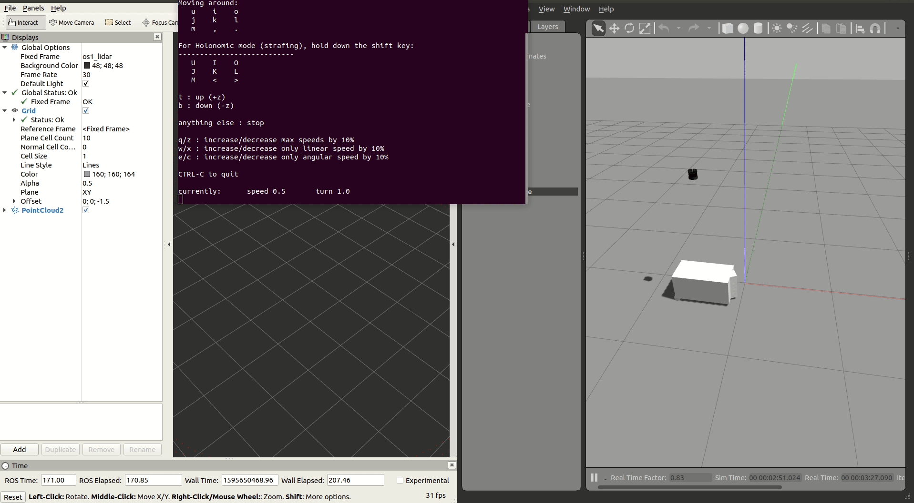

# TortoiseBot

This repository contains a simple Gazebo robot with differential drive plugin which has a Ouster OS1-64 LiDAR mounted on it. 

## Dependencies & Setup

This was tested in Ubuntu 18.04, ROS Melodic, Gazebo 9.13.2, and assumes that you have catkin tools installed.

* `hector_gazebo` (for simulating Ouster IMU)
* `ouster_example` (forked by Wil Selby)
* `eufs` (packages for simulation environment)
* `teleop_twist_keyboard`

Update Gazebo to the latest minor version 9.13.2 for use with ROS Melodic, otherwise `gpu_ray` (GPU accelerated LiDAR simulation) will most likely fail to run.

1. Follow upgrade instructions [here](http://gazebosim.org/tutorials?tut=install_ubuntu&cat=install#Alternativeinstallation:step-by-step), but instead of getting the latest `gazebo11`, we want `gazebo9`.
2. Upgrade math package `sudo apt upgrade libignition-math2`

Inside your `catkin_ws/src`, run the following to setup the required packages.

```
git clone https://github.com/MURDriverless/tortoisebot --branch task-179-detect-accel
git clone https://github.com/MURDriverless/ouster_example
git clone https://github.com/tu-darmstadt-ros-pkg/hector_gazebo

git clone https://gitlab.com/eufs/eufs_msgs
git clone https://gitlab.com/eufs/eufs_sim
```

Get the following if you would like to test the LiDAR pipeline.
```
git clone https://github.com/MURDriverless/lidar_dev --branch task-179-detect-accel
git clone https://github.com/MURDriverless/linefit_ground_segmentation
git clone https://github.com/catkin/catkin_simple
git clone https://github.com/ethz-asl/glog_catkin.git
git clone https://github.com/MURDriverless/mur_common --branch develop
```

Then install the `teleop_twist_keyboard` for controlling the robot movement.
```
sudo apt-get install ros-melodic-teleop-twist-keyboard
```

Build the packages at your `catkin_ws`.
```
catkin build
source devel/setup.bash
```

If there is build error, modify the `CMakeLists.txt` in `eufs_gazebo_plugins` to use `add_compile_options(-std=c++14)`.

## Running the simulation

Launch the robot simulation, opening Gazebo simulator and RViz for point cloud visualisation.

```
# choose one
roslaunch tortoisebot tortoisebot.launch  # empty world
roslaunch tortoisebot acceleration.launch # accel track

# run following for lidar pipeline
roslaunch lidar_dev cluster_pipeline.launch

# run in another terminal
rosrun teleop_twist_keyboard teleop_twist_keyboard.py
```

You should also be greeted with something like the simulation shown below.




```
Reading from the keyboard  and Publishing to Twist!
---------------------------
Moving around:
   u    i    o
   j    k    l
   m    ,    .

q/z : increase/decrease max speeds by 10%
w/x : increase/decrease only linear speed by 10%
e/c : increase/decrease only angular speed by 10%
anything else : stop

CTRL-C to quit
```

If you opted for the accel track and LiDAR pipeline, you will see the cone detections.


## Folder Structures

```
├── assets
├── launch
│   ├── acceleration.launch      (launch accel track)
│   ├── load_tortoisebot.launch  (load tortoisebot for accel track)
│   └── tortoisebot.launch       (launch bot with empty world)
├── rviz
│   └── tortoisebot.rviz
├── urdf
│   └── tortoisebot.urdf.xacro   (defines robot & LiDAR hz, horizontal res)
├── CMakeLists.txt
├── package.xml
└── README.md
```


## References

* [Simulating an Ouster OS1 LiDAR Sensor in ROS Gazebo and RViz](https://www.wilselby.com/2019/05/simulating-an-ouster-os-1-lidar-sensor-in-ros-gazebo-and-rviz/) by Wil Selby
* Morgan Quigley, Brian Gerkey, William D. Smart - Programming Robots with ROS - A Practical Introduction to the Robot Operating System-O'Reilly Media (2015)

## Todo
- [x] Create appropriate fork of `ouster_example`
- [x] Add instructions for setting up the robot & LiDAR from scratch
- [x] Add instructions for testing with LiDAR pipeline
- [x] Tested with `gpu_ray` for accelerated simulation, can basically run in real-time if supported GPU is used
